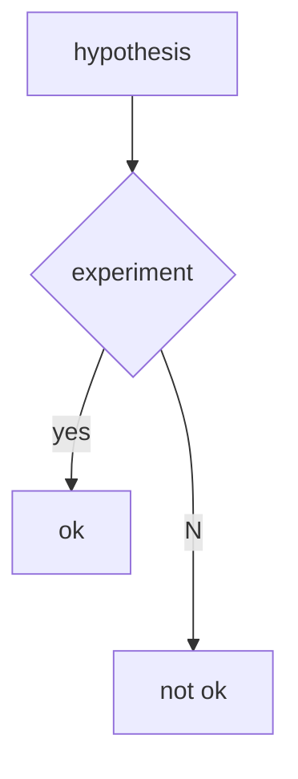

# 과학적분석 및 발표 
----
오늘 진도 못나가면 다 숙제~~~~~~

## 1차 숙제 description 
서울시 기온 평균 

최고기온 최저기온 

미래 예측 

```mermaid
flowchart TD
     A[hypothesis] --> B{experiment};
     B  -- yes --> C[ok];
     B --No--> D[not ok];
```
